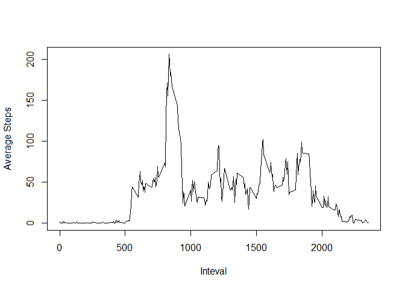

# Reproducible Research: Peer Assessment 1


## Loading and preprocessing the data

Lets load the data and store it in a dataframe "act". 
We would also like to process the data to convert the dates into proper date format. Lets look at the first few rows:


```r
act<-read.csv("activity/activity.csv") 
act$date<-as.Date(act$date,"%Y-%m-%d") 
head(act)
```

```
##   steps       date interval
## 1    NA 2012-10-01        0
## 2    NA 2012-10-01        5
## 3    NA 2012-10-01       10
## 4    NA 2012-10-01       15
## 5    NA 2012-10-01       20
## 6    NA 2012-10-01       25
```

## What is mean total number of steps taken per day?

Lets plot a histogram of the total number of steps taken each day


```r
agg <- aggregate(act$steps, list(date=act$date), sum)
hist(agg$x,xlab = "Steps per Day",main = "Total number of steps taken each day")
```

 

```r
agmean<-round(mean(agg$x,na.rm=TRUE))
agmedian<-median(agg$x,na.rm=TRUE)
```
The mean of total number of steps taken per day is 1.0766\times 10^{4} and median is 10765.


## What is the average daily activity pattern?

To understand the above problem, lets plot a line chart showing the trend of average number of steps taken for each 5 minute interval averaged across all days.


```r
agg1 <- aggregate(act$steps, list(interval=act$interval), mean,na.rm=TRUE)
plot(agg1$interval,agg1$x,type="l",ylab="Average Steps",xlab="Inteval")
```

 

```r
maxstep<-agg1[which(agg1$x==max(agg1$x)),1]
```
The maximum number of steps are observed in the interval 835.


## Imputing missing values


Lets analyze the total number of missing values:


```r
na_cnt<-nrow(act[is.na(act$steps),])
```
Total number of missing values in the dataset is 2304.


Lets impute these missing with the mean for that 5-minute interval averaged across all days and create a new dataset "act_mod" and have a look at the first few rows.


```r
act$dtkey<-julian(act$date)
int<-unique(act$interval)

act_mod <- act
for (i in 15614:15674) {           
      for (j in int) {  
   	               
		if(is.na(act_mod[which(act_mod$interval==j&act_mod$dtkey==i),1])) {
			act_mod[which(act_mod$interval==j&act_mod$dtkey==i),1]<- round(agg1[which(agg1$interval==j),2])
			} 
           }
        }
head(act_mod)
```

```
##   steps       date interval dtkey
## 1     2 2012-10-01        0 15614
## 2     0 2012-10-01        5 15614
## 3     0 2012-10-01       10 15614
## 4     0 2012-10-01       15 15614
## 5     0 2012-10-01       20 15614
## 6     2 2012-10-01       25 15614
```


As we can see the NA value of steps for the first date "2012-10-01" have now been imputed with values which are the average of the no of steps for those intervals across all days.

Now lets plot the histogram with the new data set.


```r
agg_dat <- aggregate(act_mod$steps, list(date=act_mod$date), sum)
hist(agg_dat$x,xlab = "Steps per Day",main = "Total number of steps taken each day")
```

 

```r
agmodmean<-round(mean(agg_dat$x))
agmodmedian<-median(agg_dat$x)
```

The mean of total number of steps taken per day in the new dataset is 1.0766\times 10^{4} and median is 1.0762\times 10^{4}.

As we can see comparing the analysis with the new data with that of the original data, there is no significant change in the mean and median of the new dataset from the original one.
However we can see in the histogram that no. of occurrences of steps per day in the range of 10000 to 15000 has increased. These values were previously NA.

## Are there differences in activity patterns between weekdays and weekends


To understand the above problem, we add a new column "weekday" to the modified data set. Then we divide the data set into 2 sets - one for weekdays and the other for weekends. For each of these new datasets, we plot the line graph for the average number of steps taken, averaged across all weekday days / weekend days.


```r
act_mod$weekday<-as.factor(weekdays(act_mod$date))
act_weekend<-subset(act_mod,act_mod$weekday=="Saturday"|act_mod$weekday=="Sunday")
act_weekday<-subset(act_mod,act_mod$weekday!="Saturday"& act_mod$weekday!="Sunday")
agg_weekend <- aggregate(act_weekend$steps, list(interval=act_weekend$interval), mean)
agg_weekday <- aggregate(act_weekday$steps, list(interval=act_weekday$interval), mean)
par(mfcol = c(2,1),mar=c(3,4,2,1),oma=c(0,0,0,0))
plot(agg_weekend$interval,agg_weekend$x,type="l",ylab="Number of Steps",xlab="Inteval",main="Weekend",cex.main=0.7,cex.lab=0.7,cex.axis=0.7)
plot(agg_weekday$interval,agg_weekday$x,type="l",ylab="Number of Steps",xlab="Inteval",main="Weekdays",cex.main=0.7,cex.lab=0.7,cex.axis=0.7)
```

 

As we can see from the plots, no. of steps in the interval range 500 - 1000 is more in the Weekdays. However no. of steps in the interval range 1000 - 2000 is higher in the Weekends.

